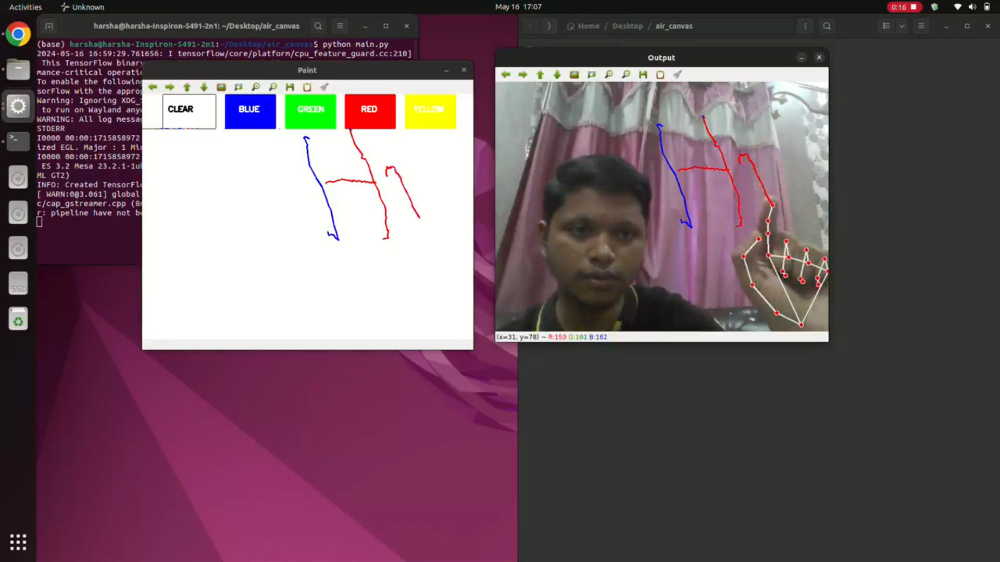

# Hand Gesture Controlled Paint Application 🎨


A hand gesture controlled paint application using Python, OpenCV, and Mediapipe. This project allows users to draw on a virtual canvas using hand gestures, making use of hand landmarks for color selection and drawing.

## Features ✨
- Draw with different colors using hand gestures.
- Clear the canvas with a hand gesture.
- Switch colors by moving the thumb close to the index finger.

## Demo 🖼️


## Installation 🛠️
1. Clone the repository:
    ```bash
    git clone https://github.com/harshaparida/Hand_cv_sketch.git
    cd Hand_cv_sketch
    ```

2. Create and activate a virtual environment (optional but recommended):
    ```bash
    python -m venv venv
    source venv/bin/activate  # On Windows use `venv\Scripts\activate`
    ```

3. Install the required dependencies:
    ```bash
    pip install -r requirements.txt
    ```

## Usage 🚀
1. Run the application:
    ```bash
    python main.py
    ```

2. Use your index finger to draw on the screen.
3. Use the buttons on the top of the canvas to change colors or clear the screen.

## Libraries Used 📚
- [OpenCV](https://opencv.org/) - Open Source Computer Vision Library
- [Mediapipe](https://mediapipe.dev/) - Cross-platform ML solutions for live and streaming media
- [NumPy](https://numpy.org/) - The fundamental package for scientific computing with Python

## Acknowledgments 🙏
- Thanks to the developers of [OpenCV](https://opencv.org/) and [Mediapipe](https://mediapipe.dev/) for providing the tools necessary to build this project.


---

Made with ❤️ by [Harsha](https://github.com/harshaparida)
