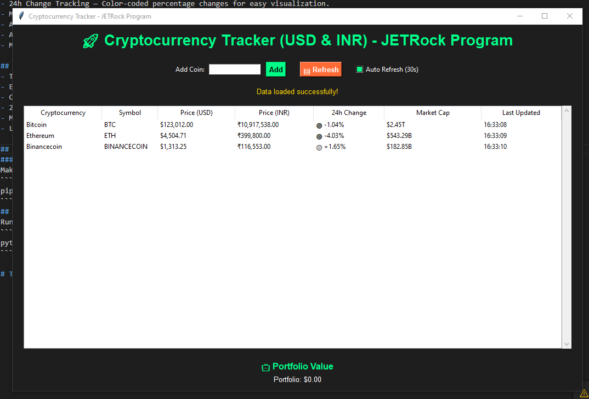

## 🚀 Cryptocurrency Tracker - JETRock Program

A Python GUI application to track real-time cryptocurrency prices using the CoinGecko API.
Built with ❤️ by [Jetur Gavli (JETRock)] — this app shows live prices in USD and INR, 24-hour changes, market caps, and more.

## Features

- Real-time Crypto Prices — Get live updates for top coins like Bitcoin, Ethereum, Solana, etc
- Dual Currency Support — Displays values in both USD and INR.
- 24h Change Tracking — Color-coded percentage changes for easy visualization.
- Market Cap Data — Instantly see how big a coin’s market is.
- Add Custom Coins — Enter any coin ID and start tracking it.
- Auto Refresh Mode — Automatically updates prices every 30 seconds.
- Modern Dark-Themed GUI — Beautiful and easy-to-read interface.

## How It Works

- The app fetches data from the CoinGecko API every few seconds.
- Each coin’s:
- Current price (USD & INR)
- 24-hour change
- Market cap
- Last updated time

## Installation

### Install dependencies

Make sure you have Python 3.8+ installed, then run:

```
pip install -r requirment.txt
```

## Usage

Run the program

```
python crypto_tracker.py
```

## Screenshort



# Thank You
