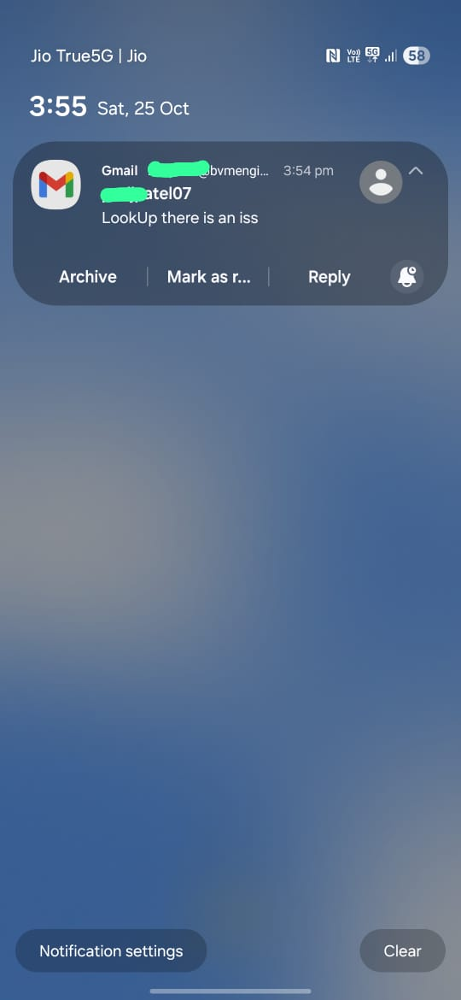

🚀 ISS Overhead Notifier  

🎯 Goal 
Notify the user via email when the International Space Station (ISS) is passing close to their location at night, so they can go outside and watch it. 

⚙️ How It Works 
🛰️ 1. Get ISS Location : Fetches real-time ISS coordinates from the Open Notify API. 
📍 2. Check Proximity : Compares ISS latitude & longitude with the user’s location (within ±5° range). 
🌙 3. Check Nighttime : Uses the Sunrise–Sunset API to get sunrise and sunset times. Confirms it’s nighttime (after sunset or before sunrise). 
✉️ 4. Send Email Alert : If both conditions are met (ISS nearby + nighttime), sends an email notification using SMTP (Gmail). 

🧠 Tech Stack  

🐍 Python 
🌐 requests – for calling APIs 
⏰ datetime – for time comparison 
📧 smtplib – for sending email notifications 

🌌 Use Case : A simple automation script for astronomy enthusiasts — alerts you when the ISS is visible from your area, so you never miss the view! 👀✨ 

