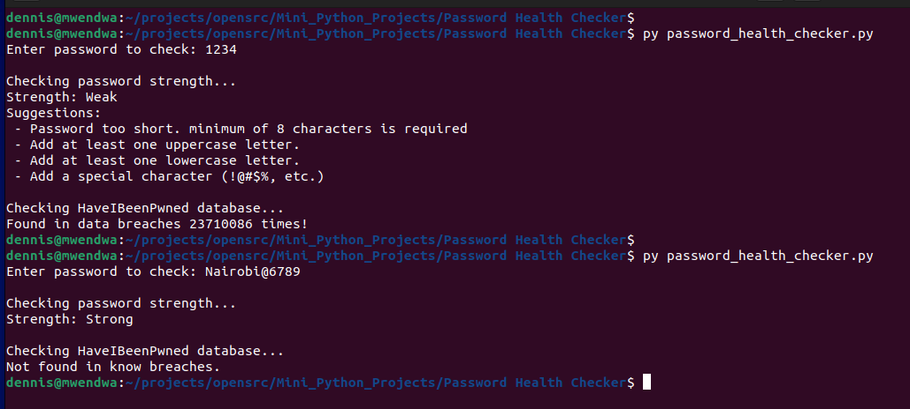

# Password Health Checker

A simple Python tool that checks how secure a user's password is by:
- Evaluating strength (length, symbols, upper/lowercase mix)
- Checking data breaches using HaveIBeenPwned API

## Features
== Local strength evaluation  
== Breach detection via API  
== Uses secure SHA-1 prefix search (k-Anonymity model)

## Requirements
```bash
pip install requests


## Screenshot

Here’s what the app looks like when running in the terminal:



<p align="center">
  
</p>
