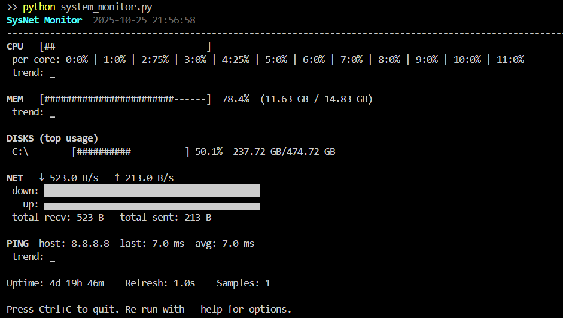

# Terminal System Monitor

A lightweight, single-file Python tool for monitoring your system and network stats directly from the terminal.  
It displays CPU, memory, disk usage, network activity, and ping metrics in a live dashboard.  
Ideal for quick diagnostics, server monitoring, or just keeping an eye on your machine.

---

## Features

- **CPU Usage:** Shows total and per-core usage with alerting.
- **Memory Usage:** Displays RAM usage, total/used, and alerting.
- **Disk Usage:** Lists top disk partitions by usage.
- **Network Activity:** Monitors upload/download rates and totals.
- **Ping Monitoring:** Measures latency to a configurable host.
- **Trends:** ASCII sparklines for historical data.
- **Customizable:** Set thresholds, refresh rate, and ping options via command-line.

---

## Screenshot



---

## Requirements

- Python 3.7+
- [psutil](https://pypi.org/project/psutil/)

Install dependencies with:

```
pip install psutil
```

---

## Usage

Run the monitor from your terminal:

```
python system_monitor.py
```

### Command-Line Options

| Option           | Description                                         | Default      |
|------------------|-----------------------------------------------------|--------------|
| `--host`         | Ping host (IP or domain)                            | 8.8.8.8      |
| `--rate`         | Refresh rate in seconds                             | 1.0          |
| `--cpu-th`       | CPU alert threshold (%)                             | 80           |
| `--mem-th`       | Memory alert threshold (%)                          | 80           |
| `--ping-th`      | Ping alert threshold (ms)                           | 200          |
| `--ping-count`   | Number of pings per refresh (0 disables, -1 always) | 3            |

Example:

```
python system_monitor.py --rate 2 --cpu-th 90 --mem-th 85 --ping-th 250 --host example.com
```

---

## How It Works

- The dashboard updates every few seconds (configurable).
- Alerts are shown if CPU, memory, or ping exceed thresholds.
- Network stats are calculated from system counters.
- Ping is performed using the system's native command.

---

## Notes

- Works on Windows, Linux, and macOS.
- For best results, run in a terminal that supports ANSI escape codes.
- No external dependencies except `psutil`.

---

## License

This project is released under the MIT License.

---

## Contributing

Pull requests and suggestions are welcome.  
Please open an issue for bugs or feature requests.

---

## Author

Aliqyaan (Open Source Contribution)