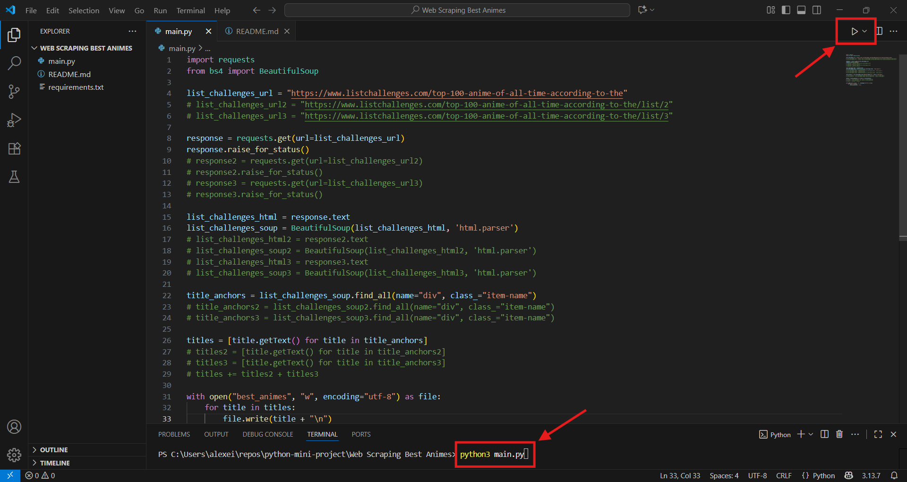
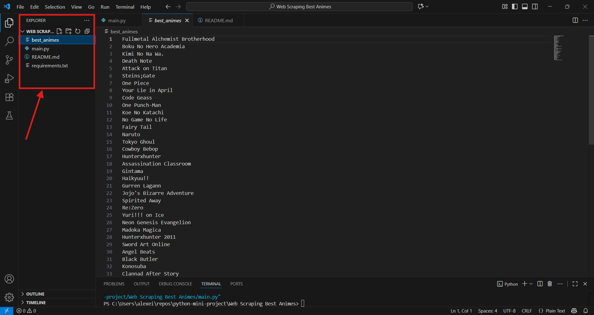

# Web Scraping Best Animes  
The following script writes in the [best_animes.txt](best_animes.txt) file the best animes according to the International Community, by Web Scraping the [List challenges](https://www.listchallenges.com/) site.  
  
### Prerequisites  
Modules required to be able to use the script successfully  
Check [requirements.txt](requirements.txt).  
  
### How to run the script  
Make sure you installed the required modules.  
Open the project folder using your favorite IDE.  
Either use your IDE's built-in "Run" button or type in the terminal "python3 main.py". 
  
P.S: As you can see a part of the code is commented, this is because https://www.listchallenges.com/top-100-anime-of-all-time-according-to-the distributes the items (animes in our case) on multiple HTML pages, therefore the code that is not commented can access only the first page which contains 40 animes. If you want to get hold of all the 100 animes you should uncomment the rest of the code, have fun!  
    
### Screenshot/GIF showing the sample use of the script  
How to run the script:  
  
  
How to see the results:  
  
  
## *Author Name*  
[Alexei Luchian](https://github.com/AlexeiLuchian)  